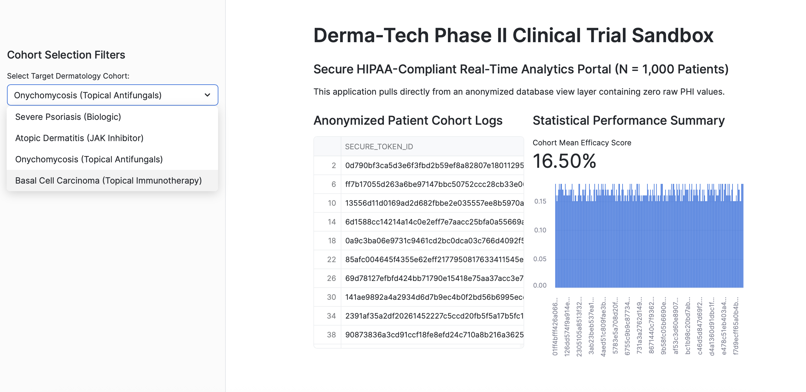
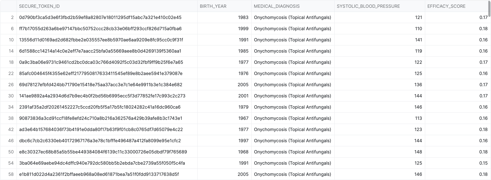
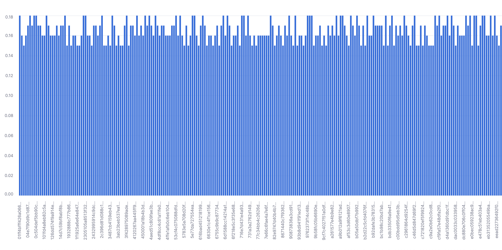

# Phase II Dermatology Clinical Trial Sandbox
### Enterprise Data Governance, HIPAA De-Identification & Real-Time Efficacy Analytics (N=1,000)

## Executive Overview
This repository contains a production-scale cloud data architecture modeling the ingestion, anonymization, and interactive visualization of a pharmaceutical clinical trial. The sandbox uses data generated from 1,000 randomized patient profiles divided into 4 different clinical dermatology tracks. Upon visualization, the data clearly demonstrates a functional pipeline that bridges healthcare safety compliance with real-time statistical modeling to influence decision-making.

The sandbox architecture addresses two critical success criteria within the modern Life Sciences tech sector:
1. PHI Protection & Compliance: Sensitive patient information is programmatically anonymized via cryptographic hashing. This ensures compliance with stringent privacy regulations without degrading the quality of the data required for tracking clinical efficacy metrics. 
2. Dynamic UI Visualization: Anonymized records are ingested into a secure cloud data layer and surfaced through an interactive Streamlit web interface, enabling cross-functional stakeholders to isolate, filter, and analyze real-time cohort metrics.

## System Architecture & Framework Components

### 1. Data Generation & Parameter Seeding (`01_database_infrastructure.sql`)
Utilizing Snowflake's computational engine, a highly structured data matrix was generated to seed 1,000 randomized patient records. The dataset is explicitly designed to simulate a multi-arm pharmaceutical clinical trial testing four distinct therapeutic tracks based on strict diagnostic criteria: 
  1. Severe Psoriasis (Biologic Track)
  2. Atopic Dermatitis (JAK Inhibitor Track)
  3. Onychomycosis (Topical Antifungal Track): Designed to mimic a strict 15%-18% clearance curve based on Jublia's efficacy model)
  4. Basal Cell Carcinoma (Topical Immunotherapy Track): Models an oncological tumor-clearance parameter track.

### 2. The HIPAA Privacy Layer (SHA-256 Hashing View)
To preserve baseline data integrity and meet strict patient privacy standards (HIPAA and PHI), a secure schema view was architected within Snowflake. This layer programmatically anonymizes direct patient identifiers using **SHA-256 cryptographic hashing**, merging sensitive profile metrics into irreversible, unique 64-character tokens. Concurrently, exact dates of birth were truncated into broad birth years to align with Safe Harbor methodologies, completely de-identifying the records before the data was streamed into the interactive UI for analytics and visualization.

### 3. Interactive Analytical Portal (`02_dashboard_application.py`)
Developed an interactive interface utilizing **Streamlit and Snowpark Python** to visualize the anonymized database view. The application delivers dynamic sidebar filtering capabilities, rendering real-time cohort distribution charts and aggregation analytics to surface mean efficacy scores organized by specific therapeutic tracking groups.

  

  

  

### 4. Live Regulatory Compliance Bridge (`03_api_ingestion_bridge.py`)
Features a Python pipeline that simulates real-world data ingestion by modeling REST API response payloads from the OpenFDA Drug Enforcement API. The script evaluates mapped pharmaceutical recall keywords and automatically links dataframe parameters back to the local patient cohort to demonstrate how clinical teams can proactively flag compliance risks.

---
## Impact Narrative 
In a live enterprise presentation, this sandbox serves as a direct proof of concept for major pharmaceutical accounts. It demonstrates that clinical research teams can monitor real-time statistical trends within a validated cloud environment, while completely mitigating global GxP data integrity risks and preventing FDA audit exposures.
